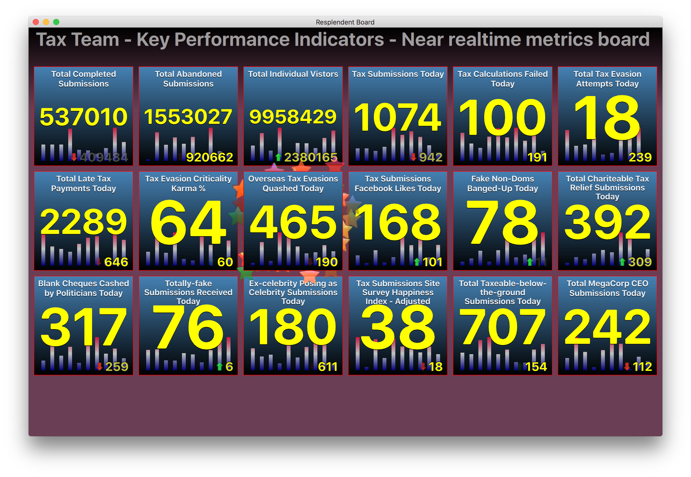
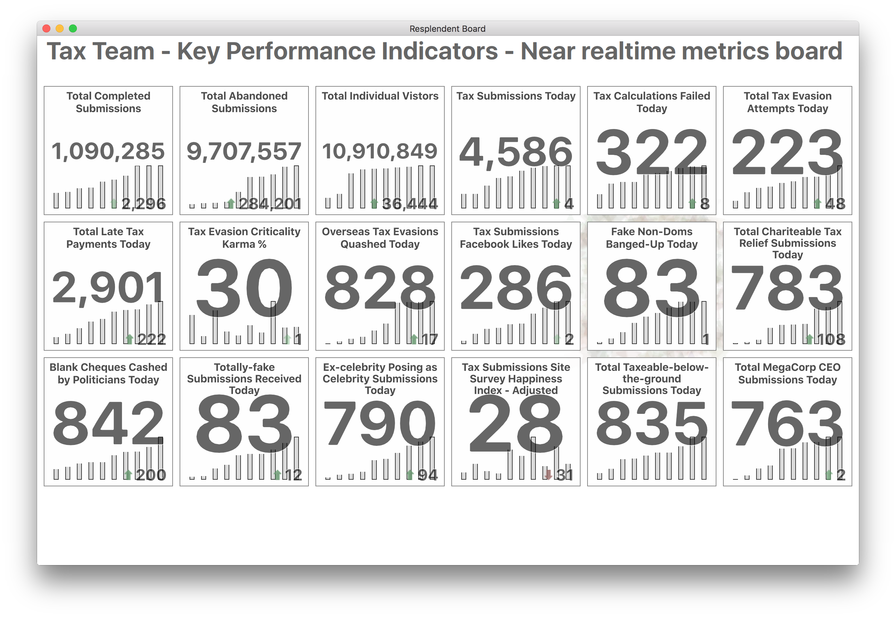
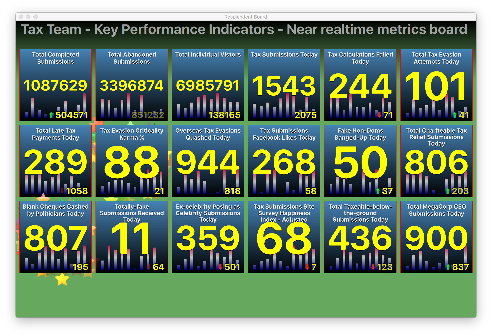

# 

This is a showcase and technology-preview of a Metrics Dashboard built in Qt/QML.

Resplendent Board is designed to provide an easy and flexible way of displaying 
metrics from existing metric-collection systems on a nice looking, fluid, animated
dashboard.

This preview was put together to demonstrate the simplicity, elegance and flexibility
of developing a Qt/QML dashboard for use as a Team Dashboard / Information Radiator
for an agile development team.

Qt/QML was chosen because of its shallow learning curve, flexibility and the animations
possible due to its use of an OpenGL hardware-accelerated scene-graph
for graphics rendering [http://doc.qt.io/qt-5/qmlapplications.html#special-effects].

## Use cases
Simple, easy to read, information radiator that collects and displays data from any
number of data sources, for an Agile development team.

Most Agile teams re-use operational dashboards such as Grafana, Dashing, Kibana, Google
Analytics, Jenkins etcetera as Information Radiators. There are a number of problems 
with this approach:

- Limited number of sources of data supported, so teams end up with many
dashboards that have an inconsistent look and feel
- Poor usability: e.g. small detail, too much infomation displayed
- Inflexible: difficult to get the look you want, without diving into the painful
world of HTML, CSS, Javascript, the DOM and Browser Incompatibility.
- Not very visually appealing (dull, dull, dull!!)
- Operational dashboards are designed for "techies", whereas Agile teams tend to have
mixed skillsets

In contrast, Resplendent Board is designed to display big, bold, fluid metrics from any
data source. You could use it to produce a "10'000 foot" view of your
Service/Build-Pipeline/Infrastructure etc.

Simplicity and consistency is the key here. Information that is important to a team
should be available at all times, in a simple visually-appealing format. It should also
offer full flexibility over the visual layout of information, putting the user first.

Resplendent Board can be used to:

- Display Key Performance Indicators for a Production service that is still undergoing
development
- Display important aspects of a team's CI/CD Delivery Pipeline, including version of
code in each environment
- Display important aspects of the Production Infrastructure and indicate problem areas

Replendant Board is *not* designed to be used as an Operational Dashboard for an
Operational Team. You are of course free to use it like that if you want.

## History
Resplendent Board came out of an internal Dashboard called Splendid Board. Splendid Board
displayed important service metrics for an international website, that was in active
development by a mixed ability agile development team.

Splendid Board was one of my first Qt/QML projects, and it showed. Although it did
everything needed, the code was monolithic, ugly and full of mistakes typical of a first
attempt at learning a new development language.

Resplendent Board is a more modular and cleaner version, that is designed for people new to
Qt/QML to pick-up the language very quickly. It also has a much better directory layout that
should make it easier to extend functionality.

There are some features of Splendid Board that have not been ported to Resplendent Board.
Hopefully all the best of the missing bits and more will be added soon.

## Requirements

In order to edit the Dashboard you will need to install Qt Creator from [https://www.qt.io/ide/].

## Development and Usage

Once Qt Creator is installed, you can open the project by selecting File>Open File or Project...
and choosing the "Resplendent-board.pro" file.

You can run the Project, by clicking the green Play button in the bottom right-hand corner of
Qt Creator.

## Directory Layout
- /configs - contains board specific items, e.g. board title, metrics to display etc.
- /metrics - metric, collection and display, code plugins
- /themes  - configurable aspects of the look and feel
- /images  - icons and graphics used by metric plugins
- Background.qml - Dashboard background display code
- Title.qml      - Main Title code
- main.qml       - The parent code of the dashboard (start here)

## Further resources on Qt/QML
- [What is QML?][http://doc.qt.io/qt-5/qmlapplications.html]
- [QML Book - Qt5 Cadaques][https://qmlbook.github.io]
- [QML Syntax QuickStart - Qt Cadaques Ch.4][https://qmlbook.github.io/en/ch04/index.html]
- [QML Tutorial][http://doc.qt.io/qt-5/qml-tutorial.html]

## More Screenshots

## Licensing

Copyright (C) 2016 Surfraz Ahmed (surfraz@gmail.com)

The code itself is Freely distributable and modifiable under the terms of the GNU
Lesser GPL (LGPL Version 3) as detailed in the LICENSE file.
